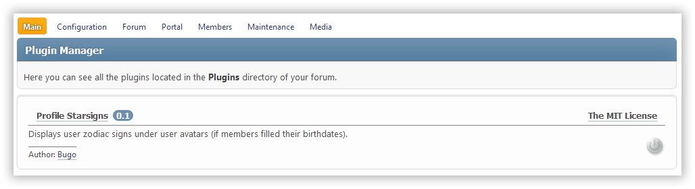

# Plugin Loader

[](https://github.com/SimpleMachines/SMF2.1)


[](https://crowdin.com/project/plugin-loader)

[Описание на русском](README.ru.md)

This concept mod is inspired by the Wedge plugin system. It adds plugin support to SMF.

Plugins are standalone modifications that do not need to be installed or removed through the Package Manager. They don't make changes to SMF files and run entirely on hooks.

The entry point of each plugin is **plugin.php** with an anonymous class inside. Also in the directory of each plugin should be a file **plugin-info.xml**, which contains the key data of the plugin:

    * name
    * description
    * plugin version
    * author name
    * link to the author's website (optional)
    * email of the author (optional)
    * the license used
    * link to the plugin site

Plugins are turned on and off at the touch of a button. To install, simply place the plugin folder with the correct structure in the **Plugins** directory.



The list of currently active plugins is stored in the global variable **$plugins** in the _Settings.php_ file. To disable a problem plugin, just _remove its name from the $plugins_ variable, or _rename the plugin folder_, or _rename the plugin.php_ file of the plugin.

## Example plugin structure

```
example_plugin/
	images/
		example.png
		index.php
	languages/
		english.php
		index.php
		russian.php
	sources/
		index.php
		plugin.php
	templates/
		index.php
		Example.template.php
	scripts/
		index.php
		example.js
	styles/
		index.php
		example.css
	index.php
	license.txt
	plugin-info.xml
```

## Example plugin-info.xml file

```xml
<?xml version="1.0" standalone="yes" ?>
<plugin id="Author:Example">
	<name>Example</name>
	<description>
		<english>Description...</english>
		<russian>Описание...</russian>
	</description>
	<version>0.1</version>
	<author email="noreply@site.com" url="https://author-site.com">Author</author>
	<license url="https://license-site.com">License name</license>
	<website>https://plugin-site.com</website>
	<settings>
		<setting name="key1" type="text" default="" />
		<setting name="key2" type="large_text" default="" />
		<setting name="key3" type="check" default="1" />
		<setting name="key4" type="int" default="1" />
	</settings>
</plugin>
```

Plugins that require creation of tables in the database for their work must contain a node `<database>file_name.php</database>` in **plugin-info.xml**. In the specified file, you can place a script to create the necessary tables when the plugin is enabled, if they have not yet been created.

## Example plugin.php file

```php
<?php

/**
 * plugin.php
 *
 * @package Example
 * @link https://plugin-site.com
 * @author Author https://author-site.com
 * @copyright 2024 Author
 * @license https://opensource.org/licenses/MIT The MIT License
 *
 * @version 0.1
 */

use Bugo\PluginLoader\Plugin;

if (!defined('SMF'))
	die('No direct access...');

return class extends Plugin
{
	public const NAME = 'example';

	#[Hook('integrate_load_theme', self::class . '::loadTheme#', __FILE__)]
	public function loadTheme(): void
	{
		// Your code

		// Use language strings
		// $this->loadLanguage();
		// var_dump($this->txt['key'])

		// Use template
		// $this->loadTemplate('Example'); // will be loaded /templates/Example.template.php

		// Use other source file of the same plugin
		// $this->loadSource('other); // will be loaded /sources/other.php

		// Use CSS file
		// $this->loadCSS('test'); // will be loaded /styles/test.css

		// Use JS file
		// $this->loadJS('test'); // will be loaded /scripts/test.js

		// Use plugin settings
		// var_dump($this->getSettings());
	}

	#[Hook('integrate_menu_buttons', self::class . '::menuButtons#', __FILE__)]
	public function menuButtons($buttons): void
	{
		// var_dump($buttons);
	}
};

```

As you can see, all hooks required by the plugin are defined using the `Hook` attribute.

## Example plugin language file

```php
<?php

return [
	'key1' => 'Text 1',
	'key2' => 'Text 2',
];

```

## Auxiliary methods

The following methods are provided to work within plugin classes:

- `loadLanguage($lang_name)` - plugging PHP language file `$lang_name` from subdirectory `languages` of the current plugin (by default `$lang_name = $context['user']['language']`)
- `loadTemplate($template_name)` - plugging PHP template file `$template_name` from subdirectory `templates` of the current plugin
- `loadCSS($css_name)` - plugging CSS file `$css_name` from subdirectory `styles` of the current plugin
- `loadJS($js_name)` - plugging JS-file `$js_name` from subdirectory `scripts` of the current plugin
- `loadSource($source_name)` - plugging PHP file `$source_name` from subdirectory `sources` of the current plugin
- `getUrl($sub_directory = '')` - returns URL to the directory of the current plugin, including `$sub_directory` (if specified)

## Examples of working plugins

- [Profile Starsigns](https://drive.proton.me/urls/8ZX5G1QXSR#WG0Yl99C0NJw)
- [Font Awesome](https://drive.proton.me/urls/ABF7BBDC80#Eo0cVWRbrbxi)
- [Yandex Metrica](https://drive.proton.me/urls/16ZEE2PCKW#UI0yxQoG7BKP)
